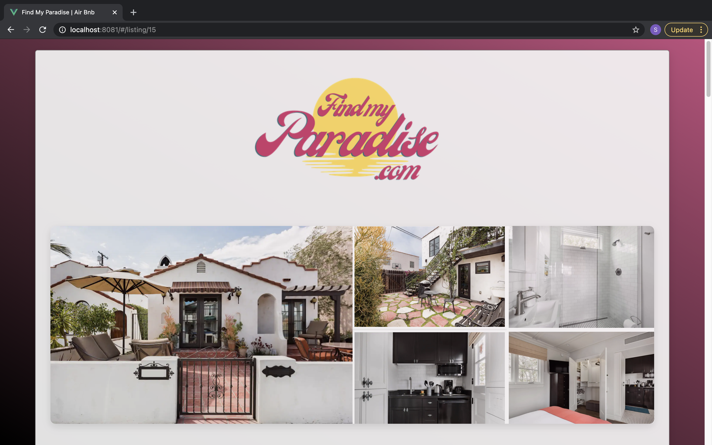
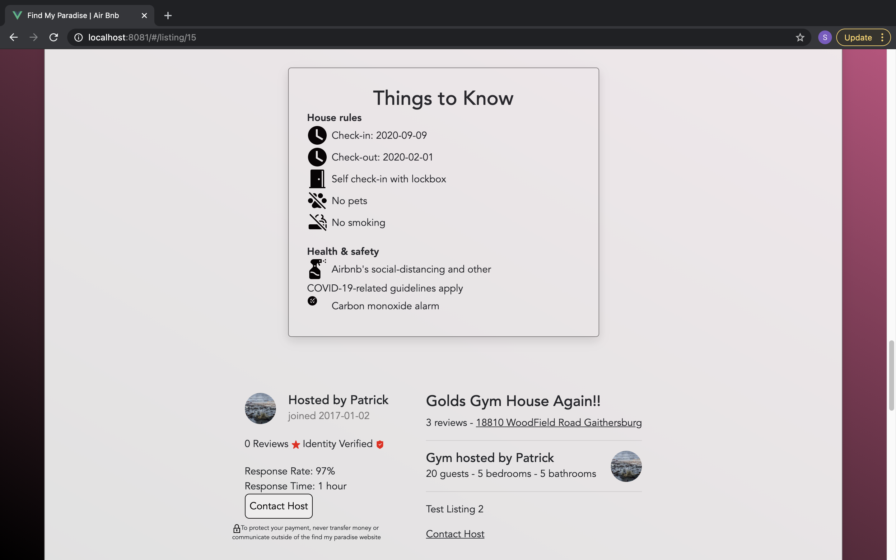

## Contact Information
* Email: collinswilliam122396@gmail.com
* Phone: (912) 326-3622
* [LinkedIn](https://www.linkedin.com/in/william-collins-0a1963172/)

## Summary
* Fullstack Software Engineer
* Passionate about solving problems
* Proficient in Java, Python, Javascript, and Typescript
* Experience with
	* Frontend: HTML/CSS, Angular, Vue
	* Backend: Spring Boot, PostgreSQL, MySQL

## Education
* Georgia Institute of Technology (2015-2020)
	* Bachelor's Degree in Computer Science
	* Concentrations in Artificial Intelligence and Information Internetworks

## Projects
* [**Find My Paradise**](https://github.com/Smelser-Squad/FindMyParadise)
	* One of 12 contributors
	* Technologies used: Java, Spring Boot, MySQL, Vue, HTML/CSS
	* Mockup up Airbnb listing page

* [**Steam Backlog Tracker**](https://github.com/wcollins37/steam-backlog-tracker)
	* Sole contributor
	* Technologies used: Java, Spring Boot, PostgreSQL, Angular, TypeScript, HTML/CSS
	* App to help a Steam user sort through and manage their library
	* Uses real Steam data using Valve's web API

* [**Wizard Battle**](https://github.com/wcollins37/WizardBattle)
	* Sole contributor
	* Technologies used: Java
	* Turn-based strategy game played in the terminal
	* Plan to develop Angular UI

